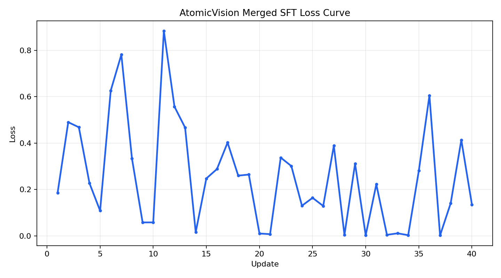
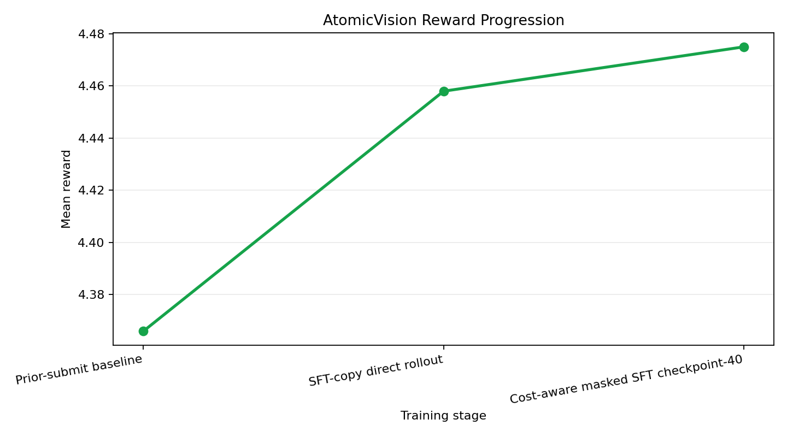
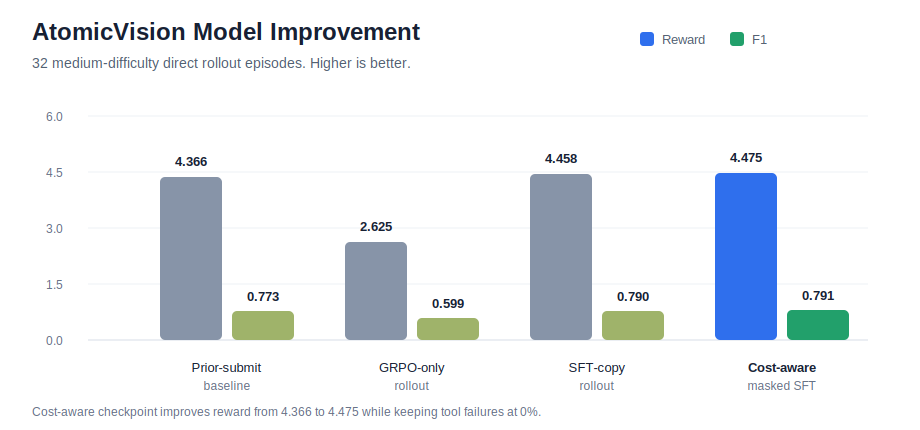
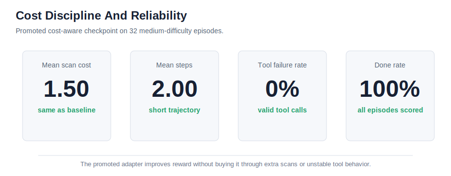

# AtomicVision

**AtomicVision: An Autonomous AI Agent for Non-Destructive Multi-Defect Mapping**

AtomicVision is a hackathon-focused OpenEnv project for AI-assisted materials
characterization. It frames atomic defect mapping as a partially observable
scientific lab environment: an agent receives non-invasive vibrational spectra,
chooses characterization actions, and submits a defect map while balancing
accuracy against scan cost.

## Quick Links

- Theme fit: `Theme #3.1 - World Modeling / Professional Tasks`
- Hugging Face Space: [prodigyhuh/atomicvision-openenv](https://huggingface.co/spaces/prodigyhuh/atomicvision-openenv)
- Public app host: [prodigyhuh-atomicvision-openenv.hf.space](https://prodigyhuh-atomicvision-openenv.hf.space)
- Best published adapter: [prodigyhuh/atomicvision-hard-recall-micro-boost-lora](https://huggingface.co/prodigyhuh/atomicvision-hard-recall-micro-boost-lora)
- Winning promotion run: [docs/hard-recall-micro-repair-results.md](docs/hard-recall-micro-repair-results.md) (`checkpoint-1`, now published)
- Previous best adapter: [prodigyhuh/atomicvision-medium-fidelity-boost-lora](https://huggingface.co/prodigyhuh/atomicvision-medium-fidelity-boost-lora)
- Stable fallback adapter: [prodigyhuh/atomicvision-format-submit-merged-lora](https://huggingface.co/prodigyhuh/atomicvision-format-submit-merged-lora)
- Judge repro notebook: [notebooks/AtomicVision_Judge_Repro_Colab.ipynb](notebooks/AtomicVision_Judge_Repro_Colab.ipynb) - full rebuild, saved-adapter continuation, and hard-frontier booster
- Open in Colab: [AtomicVision Judge Repro Colab](https://colab.research.google.com/github/Adityabaskati-weeb/-AtomicVision-An-Autonomous-AI-Agent-for-Non-Destructive-Multi-Defect-Mapping/blob/main/notebooks/AtomicVision_Judge_Repro_Colab.ipynb)
- Training script: [training/train_sft_atomicvision_safe.py](training/train_sft_atomicvision_safe.py)
- Writeup: [docs/judge-writeup.md](docs/judge-writeup.md)
- Legacy GRPO bridge: [notebooks/AtomicVision_GRPO_Colab.ipynb](notebooks/AtomicVision_GRPO_Colab.ipynb)
- Deployment notes: [docs/phase-9-huggingface-deployment.md](docs/phase-9-huggingface-deployment.md)
- Runtime runbook: [docs/training-runtime-runbook.md](docs/training-runtime-runbook.md)
- HF Jobs training playbook: [docs/hf-jobs-training-playbook.md](docs/hf-jobs-training-playbook.md)
- Training data architecture: [docs/training-data-architecture.md](docs/training-data-architecture.md)
- Model training roadmap: [docs/model-training-generalization-roadmap.md](docs/model-training-generalization-roadmap.md)
- Experiment lineage: [docs/experiment-lineage.md](docs/experiment-lineage.md)
- Submission checklist: [docs/hackathon-submission-checklist.md](docs/hackathon-submission-checklist.md)
- Mini-blog draft: [docs/hackathon-mini-blog-draft.md](docs/hackathon-mini-blog-draft.md)

## Validator Deliverables

- Public Space: [prodigyhuh/atomicvision-openenv](https://huggingface.co/spaces/prodigyhuh/atomicvision-openenv)
- OpenEnv manifest: [openenv.yaml](openenv.yaml)
- Installable package metadata: [pyproject.toml](pyproject.toml)
- Reproducible dependency lock: [uv.lock](uv.lock)
- Judge notebook: [notebooks/AtomicVision_Judge_Repro_Colab.ipynb](notebooks/AtomicVision_Judge_Repro_Colab.ipynb)
- Runnable training script: [training/train_sft_atomicvision_safe.py](training/train_sft_atomicvision_safe.py)
- Writeup: [docs/judge-writeup.md](docs/judge-writeup.md)
- Loss curve image: [docs/training-loss-curve.png](docs/training-loss-curve.png)
- Reward curve image: [docs/training-reward-curve.png](docs/training-reward-curve.png)





## OpenEnv Space Structure

AtomicVision now matches the three-part HF Space structure shown in the OpenEnv
submission guidance:

| Component | AtomicVision artifact | How to use it |
| --- | --- | --- |
| Running environment endpoint | [prodigyhuh-atomicvision-openenv.hf.space](https://prodigyhuh-atomicvision-openenv.hf.space) | public app and API host |
| Installable repository package | [pyproject.toml](pyproject.toml), [atomicvision_env](atomicvision_env) | `pip install git+https://huggingface.co/spaces/prodigyhuh/atomicvision-openenv` |
| Docker registry image | Docker Space for [prodigyhuh/atomicvision-openenv](https://huggingface.co/spaces/prodigyhuh/atomicvision-openenv) | use the Space's `Run with Docker` button for the exact `registry.hf.space/...` command |

Important endpoints exposed by the Space:

- `/health` - health check
- `/docs` - OpenAPI docs
- `/ws` - persistent session websocket used by the OpenEnv client
- `/reset` - stateless reset
- `/step` - stateless step
- `/state` - current state

## Local Development

Clone the Space repository and run it locally:

```bash
git clone https://huggingface.co/spaces/prodigyhuh/atomicvision-openenv
cd atomicvision-openenv
uv sync --frozen
uv run server
```

The committed `uv.lock` pins the local dependency graph used by this workflow.

For direct Uvicorn control:

```bash
uvicorn atomicvision_env.server.app:app --host 0.0.0.0 --port 7860 --workers 4
```

Install the client package directly from the public Space repository:

```bash
pip install git+https://huggingface.co/spaces/prodigyhuh/atomicvision-openenv
```

Use the installed client package against the hosted Space:

```python
import asyncio

from atomicvision_env import AtomicVisionAction, AtomicVisionEnv


async def main() -> None:
    async with AtomicVisionEnv(
        base_url="https://prodigyhuh-atomicvision-openenv.hf.space"
    ) as client:
        first = await client.reset()
        second = await client.step(
            AtomicVisionAction(action_type="ask_prior")
        )
        print(first)
        print(second)


asyncio.run(main())
```

Or use the sync wrapper against a local server:

```python
from atomicvision_env import AtomicVisionAction, AtomicVisionEnv

with AtomicVisionEnv(base_url="http://localhost:7860").sync() as client:
    result = client.step(AtomicVisionAction(action_type="ask_prior"))
    print(result)
```

Run the Space container locally:

```bash
docker login registry.hf.space
# Then open the Space page and use "Run with Docker" to copy the exact image name.
```

Build and run the current repo directly:

```bash
docker build -t atomicvision-openenv:latest .
docker run -d -p 7860:7860 --name atomicvision-openenv atomicvision-openenv:latest
```

## Deploy With OpenEnv CLI

Initialize a new environment from the CLI:

```bash
openenv init my_env
cd my_env
```

Deploy AtomicVision to your namespace or to a specific Space repo:

```bash
openenv push
openenv push --repo-id prodigyhuh/atomicvision-openenv
```

## Submission Story

### Problem

AtomicVision targets a capability gap that generic chat models still handle
poorly: cost-aware scientific decision making under partial observability. The
agent must turn compact spectral evidence into a final defect map without
destructive measurements or unlimited scans.

### Environment

The environment is a real OpenEnv lab loop, not a static dataset prompt. The
agent:

- starts from a low-cost spectral observation,
- chooses scientific tools such as `ask_prior`, `compare_reference`, or scans,
- pays explicit budget costs for each action,
- and is scored on defect identity, concentration quality, confidence, and
  wasteful behavior penalties.

### Results

The current best published adapter is
[prodigyhuh/atomicvision-hard-recall-micro-boost-lora](https://huggingface.co/prodigyhuh/atomicvision-hard-recall-micro-boost-lora).
It is the published `checkpoint-1` winner from the
[hard-recall micro-repair run](docs/hard-recall-micro-repair-results.md).

Final held-out strict comparison versus the previous best published adapter:

| Metric | Previous best | Current best | Delta |
| --- | ---: | ---: | ---: |
| `medium_reward` | `4.5065` | `4.5065` | `0.0000` |
| `medium_f1` | `0.7891` | `0.7891` | `0.0000` |
| `hard_reward` | `4.6917` | `4.7148` | `+0.0231` |
| `hard_f1` | `0.8162` | `0.8207` | `+0.0045` |
| `strict_tool_call_pass_rate` | `1.00` | `1.00` | `0.00` |
| `normalized_tool_call_pass_rate` | `1.00` | `1.00` | `0.00` |
| `tool_failure_rate` | `0.00` | `0.00` | `0.00` |
| `done_rate` | `1.00` | `1.00` | `0.00` |

So the final promoted model improved the hard slice without regressing medium or
breaking execution.

### Why It Matters

This project turns LLM training into a scientifically grounded professional-task
environment: the model has to choose, spend, justify, and finish correctly
rather than just produce plausible text. That makes it useful both as a
hackathon submission and as a research sandbox for tool-using agents.

## Interesting Artifacts

- Latest GRPO probe writeup: [docs/hard-only-grpo-reference-probe-results.md](docs/hard-only-grpo-reference-probe-results.md)
- Latest GRPO probe metrics JSON: [docs/hard-only-grpo-reference-probe-metrics.json](docs/hard-only-grpo-reference-probe-metrics.json)
- Latest hard-recall micro-repair writeup: [docs/hard-recall-micro-repair-results.md](docs/hard-recall-micro-repair-results.md)
- Latest hard-recall micro-repair metrics JSON: [docs/hard-recall-micro-repair-metrics.json](docs/hard-recall-micro-repair-metrics.json)
- Latest HF Jobs probe run:
  [job 69ec694ad2c8bd8662bcd2d2](https://huggingface.co/jobs/prodigyhuh/69ec694ad2c8bd8662bcd2d2)
- Mini-blog draft: [docs/hackathon-mini-blog-draft.md](docs/hackathon-mini-blog-draft.md)

The project is moving phase by phase. Each stage is implemented only after the
previous gate has been validated.

## Current Phase

- Phase 0: Scope Lock
- Phase 1: System Design
- Phase 2: Environment Contract
- Phase 3: Synthetic Materials World
- Phase 4: Reward Scoring And Metrics
- Phase 5: OpenEnv Wrapper
- Phase 6: Baselines And Evaluation
- Phase 7: DefectNet-Lite
- Phase 8: Model Prior Training
- Phase 9: Hugging Face Space Deployment
- Phase 10: Reward Comparison And Colab Bridge
- Phase 11: GRPO Fine-Tuning Scaffold
- Phase 12: SFT Copy LoRA Rollout
- Phase 13: Format-Aware GRPO Continuation
- Phase 14: Held-Out Evaluation And GRPO Roadmap
- Phase 15: NaN-Safe SFT Recovery
- Phase 16: Format-Repair And Two-Step Curriculum
- Status: the current best published adapter is
  `atomicvision-hard-recall-micro-boost-lora`; the previous best base is
  `atomicvision-medium-fidelity-boost-lora`; the stable fallback is
  `atomicvision-format-submit-merged-lora`; held-out evaluation now uses the
  official eval-only seed band before any new promotion decision
- Scope document: [docs/phase-0-scope-lock.md](docs/phase-0-scope-lock.md)
- System design: [docs/phase-1-system-design.md](docs/phase-1-system-design.md)
- Environment contract: [docs/phase-2-environment-contract.md](docs/phase-2-environment-contract.md)
- Synthetic world: [docs/phase-3-synthetic-world.md](docs/phase-3-synthetic-world.md)
- Rewards and metrics: [docs/phase-4-rewards-and-metrics.md](docs/phase-4-rewards-and-metrics.md)
- OpenEnv wrapper: [docs/phase-5-openenv-wrapper.md](docs/phase-5-openenv-wrapper.md)
- Baselines and evaluation: [docs/phase-6-baselines-and-evaluation.md](docs/phase-6-baselines-and-evaluation.md)
- DefectNet-lite: [docs/phase-7-defectnet-lite.md](docs/phase-7-defectnet-lite.md)
- Model prior training: [docs/phase-8-model-prior-training.md](docs/phase-8-model-prior-training.md)
- Hugging Face deployment: [docs/phase-9-huggingface-deployment.md](docs/phase-9-huggingface-deployment.md)
- Phase 10 notes: [docs/phase-10-reward-comparison-and-colab.md](docs/phase-10-reward-comparison-and-colab.md)
- Phase 11 notes: [docs/phase-11-finetuning-plan.md](docs/phase-11-finetuning-plan.md)
- Lecture 91 method notes: [docs/lecture-91-openenv-method-notes.md](docs/lecture-91-openenv-method-notes.md)
- Training runbook: [docs/training-runtime-runbook.md](docs/training-runtime-runbook.md)
- HF Jobs training playbook: [docs/hf-jobs-training-playbook.md](docs/hf-jobs-training-playbook.md)
- Training data architecture: [docs/training-data-architecture.md](docs/training-data-architecture.md)
- Model training roadmap: [docs/model-training-generalization-roadmap.md](docs/model-training-generalization-roadmap.md)
- Experiment lineage: [docs/experiment-lineage.md](docs/experiment-lineage.md)
- Held-out + GRPO roadmap: [docs/phase-14-heldout-grpo-roadmap.md](docs/phase-14-heldout-grpo-roadmap.md)
- NaN-safe SFT recovery: [docs/phase-15-nan-safe-sft-recovery.md](docs/phase-15-nan-safe-sft-recovery.md)
- Format-repair SFT: [docs/phase-16-format-repair-sft.md](docs/phase-16-format-repair-sft.md)
- Reward comparison: [docs/reward-comparison-report.md](docs/reward-comparison-report.md)
- SFT-copy rollout result: [docs/sft-copy-lora-results.md](docs/sft-copy-lora-results.md)
- Cost-aware masked SFT result: [docs/cost-aware-masked-sft-results.md](docs/cost-aware-masked-sft-results.md)
- GRPO continuation smoke result: [docs/grpo-continuation-smoke-results.md](docs/grpo-continuation-smoke-results.md)
- Judge repro Colab: [notebooks/AtomicVision_Judge_Repro_Colab.ipynb](notebooks/AtomicVision_Judge_Repro_Colab.ipynb)
- Legacy Colab bridge: [notebooks/AtomicVision_GRPO_Colab.ipynb](notebooks/AtomicVision_GRPO_Colab.ipynb)

## Current Gate Status

AtomicVision is now in a verifier-hardening phase before GRPO. The current
question is not "can we train another adapter?" but "can the trained adapter
reliably emit valid tool calls on held-out seeds?"

Current status:

- Stable environment: yes
- Stable NaN-safe SFT path: yes
- Held-out strict tool-call gate: pass
- Official normalized held-out eval path: healthy
- GRPO readiness: not yet; hard cases still trail the baseline

The project now tracks both:

- **strict execution**: the model must emit one exact JSON tool call
- **normalized execution**: near-miss outputs are canonicalized for diagnosis

This split makes it much easier to tell whether a failure is:

- policy quality
- tool-call formatting
- or a reward / execution mismatch

## Current Best Held-Out Checkpoint

The current best published checkpoint is
[prodigyhuh/atomicvision-medium-fidelity-boost-lora](https://huggingface.co/prodigyhuh/atomicvision-medium-fidelity-boost-lora).
It preserves perfect strict and normalized verifier columns, improves the
medium held-out reward above the prior-submit baseline, and keeps the hard
slice unchanged relative to the previous stable adapter.

| Adapter | Medium reward | Hard reward | Strict pass | Done rate | Notes |
| --- | ---: | ---: | ---: | ---: | --- |
| Prior-submit baseline | 4.5115 | 4.8883 | 1.00 | 1.00 | Reference policy |
| `atomicvision-format-submit-merged-lora` | 4.3812 | 4.6466 | 1.00 | 1.00 | Stable recovery adapter |
| `atomicvision-medium-fidelity-boost-lora` | 4.5707 | 4.6466 | 1.00 | 1.00 | Current best checkpoint |

The remaining gap is now concentrated in hard frontier quality, not formatting
or tool-call execution.

## Official Seed Policy

AtomicVision now uses one permanent seed split:

- SFT data generation: `1000-3999`
- GRPO prompt selection: `4000-7999`
- held-out evaluation only: `10000-10999`

Promotion claims should use the held-out eval band only.

## Best Demo Result

The best current in-distribution demo result is still the cost-aware masked SFT
checkpoint-40 on medium episodes. That result is useful for the demo package,
but it is **not** yet the final held-out promotion bar.

| Evaluation | Episodes | Reward | F1 | MAE | Steps | Scan cost | Tool failures | Done rate |
| --- | ---: | ---: | ---: | ---: | ---: | ---: | ---: | ---: |
| Cost-aware masked SFT checkpoint-40 | 32 | 4.475 | 0.791 | 0.0288 | 2.00 | 1.50 | 0.00 | 1.00 |
| GRPO-only direct rollout | 32 | 2.625 | 0.599 | 0.0783 | 2.03 | 1.55 | 0.00 | 1.00 |
| SFT-copy direct rollout | 32 | 4.458 | 0.790 | 0.0321 | 2.06 | 1.55 | 0.00 | 1.00 |
| Prior-submit baseline | 32 | 4.366 | 0.773 | 0.0318 | 2.00 | 1.50 | 0.00 | 1.00 |





## Held-Out Verifier Columns

The official adapter evaluator now reports:

- `strict_tool_call_pass_rate`
- `normalized_tool_call_pass_rate`
- `normalized_tool_call_repair_rate`
- `first_action_valid_rate`
- `first_action_ask_prior_rate`
- `submit_action_rate`
- `done_rate`
- `tool_failure_rate`

This is the current reliability gate before GRPO. A model that only looks good
on reward but fails these verifier columns is not considered ready.

## Next Training Gate

The next promotion order is:

1. run strict + normalized held-out eval with `training/evaluate_atomicvision_adapter.py`
2. confirm non-zero success on held-out seeds
3. only then run `cost-aware-variance-probe`
4. only then run short GRPO continuation

The earlier 20-step GRPO continuation completed successfully on Kaggle, but it
was not promoted. More importantly, later held-out recovery runs showed that
tool-call formatting can still collapse even when training loss looks healthy.
That is why verifier columns are now treated as first-class gates rather than
optional diagnostics.

The latest short HF Jobs GRPO probe now has a committed writeup and metrics
artifact:

- [docs/hard-only-grpo-reference-probe-results.md](docs/hard-only-grpo-reference-probe-results.md)
- [docs/hard-only-grpo-reference-probe-metrics.json](docs/hard-only-grpo-reference-probe-metrics.json)

That probe produced real reward variance, but it still failed the continuation
gate because `submit_tool_rate` and `strict_tool_call_pass_rate` stayed at
`0.0`.
