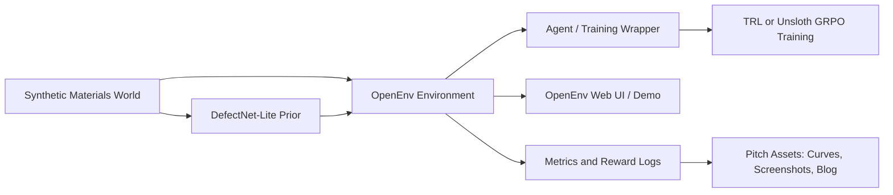

# Phase 1 System Design

## Purpose

Phase 1 defines the AtomicVision system architecture before implementation. The goal is to make every later file, model, environment, metric, and demo component trace back to a clear responsibility.

No environment or model code is implemented in this phase.

## Design Principles

- OpenEnv first: the project is an agent environment, not a standalone classifier.
- Synthetic but honest: the MVP uses generated spectra and clearly labels them as simulated.
- Visible learning: the system must produce reward curves and before/after agent behavior.
- CPU-friendly MVP: deployment should work on standard Hugging Face Space hardware unless a GPU upgrade becomes necessary.
- Small trusted core: keep the environment, data generator, reward logic, and demo separate enough to test independently.
- Reproducible by seed: every generated material episode must be replayable.

## High-Level Architecture



## System Modules

| Module | Responsibility | Must Not Do |
| --- | --- | --- |
| Synthetic Materials World | Generate host materials, pristine spectra, defective spectra, hidden labels, noise, and difficulty levels. | Serve HTTP, train models, or make agent decisions. |
| OpenEnv Environment | Own episode lifecycle, observations, actions, reward, state, and termination. | Hide reward logic in UI code or call training loops directly. |
| DefectNet-Lite Prior | Provide a compact PyTorch or heuristic predictor for defect identity/concentration hints. | Become the only thing judges see. It supports the agent, not replaces it. |
| Agent Training Wrapper | Expose environment actions as tools for TRL or Unsloth training. | Duplicate environment state or reward calculations. |
| Demo UI | Visualize spectra, scan history, actions, predictions, and rewards. | Contain scientific logic. |
| Evaluation Scripts | Compare random, heuristic, and trained policies on fixed seeds. | Change environment behavior during evaluation. |
| Documentation and Pitch Assets | Explain scope, scientific inspiration, requirements, and results. | Overclaim real-world validation. |

## Episode Lifecycle

1. `reset()` samples a hidden material case from the synthetic world.
2. Environment returns an initial observation with a low-cost scan and metadata.
3. Agent chooses an action.
4. `step(action)` updates scan history, budget, observation, and reward.
5. Agent may request more evidence or submit a final defect map.
6. Episode terminates on submit, budget exhaustion, or step limit.
7. Environment logs reward components and final metrics.

## Data Flow

| Stage | Input | Output |
| --- | --- | --- |
| Case generation | Random seed, difficulty config | Hidden material state and ground-truth defects |
| Spectrum simulation | Host state, defect set, scan config | Pristine and defective PDoS-like spectra |
| Observation packaging | Spectrum, scan history, budget | Typed OpenEnv observation |
| Agent action | Observation text/schema | Typed OpenEnv action |
| Reward scoring | Action, ground truth, scan cost | Reward and reward breakdown |
| Evaluation | Fixed seed episodes, policy | Reward curves and metrics table |

## Planned Repository Layout

```text
AtomicVision/
  README.md
  docs/
    phase-0-scope-lock.md
    phase-1-system-design.md
    pitch-script.md
    blog-draft.md
  atomicvision_env/
    __init__.py
    models.py
    client.py
    openenv.yaml
    server/
      app.py
      environment.py
      Dockerfile
      requirements.txt
  atomicvision/
    synthetic/
      generator.py
      spectra.py
      difficulty.py
    models/
      defectnet_lite.py
      baselines.py
    rewards/
      scoring.py
    evaluation/
      run_eval.py
      metrics.py
  training/
    train_defectnet_lite.py
    train_grpo_trl.py
  notebooks/
    AtomicVision_GRPO_Colab.ipynb
  outputs/
    metrics/
    plots/
    demo_cases/
  tests/
    test_synthetic_generator.py
    test_reward_scoring.py
    test_environment_contract.py
```

## Key Interfaces To Design In Phase 2

Phase 2 will finalize exact fields. Phase 1 only locks boundaries.

Observation categories:

- Case metadata.
- Current spectrum.
- Optional pristine reference.
- Scan history.
- Budget and step count.
- Prior predictions, if requested.

Action categories:

- Request scan.
- Zoom into spectral band.
- Compare reference.
- Ask for prior.
- Submit final defect map.

State categories:

- Episode id.
- Seed.
- Difficulty.
- Hidden ground truth, server-side only.
- Step count.
- Done flag.
- Reward history.

## Difficulty Curriculum

| Difficulty | Defects | Noise | Scan Budget | Purpose |
| --- | ---: | --- | ---: | --- |
| Easy | 1 | Low | High | Prove environment and reward loop. |
| Medium | 2-3 | Moderate | Medium | Show meaningful agent choices. |
| Hard | 4-6 | High | Medium | Demonstrate multi-defect challenge. |
| Expert | 4-6 plus distractors | High | Low | Stretch/demo challenge after MVP. |

## Baselines

| Baseline | Why It Exists |
| --- | --- |
| Random policy | Establish lower bound for rewards. |
| Greedy scan policy | Show whether more scans alone solve the task. |
| DefectNet-Lite direct submit | Separate predictor quality from agent planning quality. |
| Trained agent | Show reward improvement through environment interaction. |

## Reward Components

Phase 2 will finalize formulas. Phase 1 locks component intent:

- Identity reward for correct defect species.
- Concentration reward for low numeric error.
- Confidence reward for calibrated predictions.
- Scan cost penalty.
- False positive penalty.
- Missed defect penalty.
- Timeout or no-submit penalty.

## Demo Requirements

The first demo screen must show the actual experience, not a marketing page.

Required visible elements:

- Current spectrum plot.
- Agent action history.
- Predicted defects and concentrations.
- Reward breakdown.
- Budget remaining.
- Baseline versus trained reward curve.

## Technical Stack

| Layer | Planned Choice |
| --- | --- |
| Environment framework | OpenEnv latest release, rechecked before implementation |
| Core ML | PyTorch |
| Agent training | HF TRL GRPO or Unsloth GRPO |
| Schemas | Pydantic |
| Data processing | NumPy, pandas |
| Visualization | Matplotlib or Plotly for spectra and reward curves |
| Hosting | Hugging Face Space |
| Packaging | OpenEnv package layout plus Docker if required |

## Validation Strategy

Each later phase must add tests before moving on:

- Synthetic data tests: deterministic seeds, expected spectrum shape, valid labels.
- Reward tests: correct predictions score higher than wrong predictions, scan cost lowers reward.
- Environment tests: reset/step/state work and terminate correctly.
- Training smoke test: minimal loop runs on a tiny dataset.
- Deployment smoke test: `/health`, `/docs`, and `/web` load on the Space.

## Phase 1 Completion Gate

Phase 1 is complete only when:

- System architecture is documented.
- Module boundaries are documented.
- Data flow is documented.
- Planned repository layout is documented.
- Episode lifecycle is documented.
- Baselines are documented.
- Validation strategy is documented.
- No implementation code has been added.
- Repo validation passes for Phase 1 documentation.

## Phase 2 Entry Criteria

Start Phase 2 only after this design is accepted as the system blueprint. Phase 2 will define exact OpenEnv schemas, reward equations, termination rules, and phase-specific tests.
